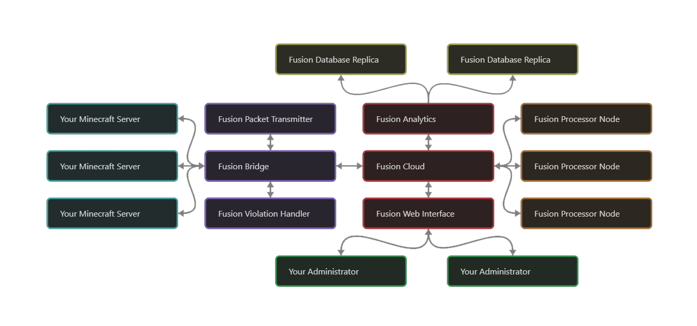

Fusion is a cloud-based enterprise-grade anti-cheat software for your Minecraft server. It utilises modern solutions for detecting and mitigating illegal client modifications.

A new version of Fusion is currently in development. Check out our [website](https://fusion.ac) and [discord server](https://discord.gg/rNRVEnNFM5) for further information.

## Infrastructure

Fusion infrastructure is built upon an enterprise-grade architecture that ensures fast data processing and high availability.

## Lightweight

Unlike most anti-cheats, Fusion doesn't run any calculations on your server. This way the system runs incredibely lightweight. All heavy tasks are distributed accross our cloud servers, therefore ensuring you have a smooth experience using the anti-cheat.

In conclusion, Fusion doesn't require you to upgrade your hardware to be able to process enormous amounts of data. We process data for you.

## High availability

We have multiple data processing nodes dedicated for your servers. This means that calculations are running parallel and fast. This means that the vilations and mitigations are running almost in real-time.

## Easy configurations

If you own a large Minecraft server, you might face the problem of having to update anti-cheat configurations for plenty of servers at a time. Fusion's cloud system does the work for you. All configurations can be modified via the cloud, and can be shared accross your entire network with even server-specific changes.

## Fast support

We care about your time. Our support team is there to help you in case you have a question or any trouble using our services. Feel free to contact us on [discord](https://discord.gg/rNRVEnNFM5).

 

Fusion anti-cheat solutions. Protecting your Minecrat servers since 2019.
